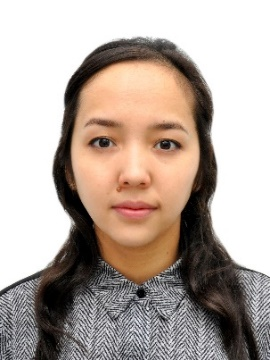

## Akerke Otarbayeva

### Contact

**Mobile:** +7 (708) 175 71 21

**E-mail:** akerke.otarbayeva@gmail.com

### Education 
*   M.S.:  Nuclear physics, 2017 
    L.N.Gumilyov Eurasian National University - Astana, Kazakhstan. 

*   B.S.:  Nuclear physics, 2015
    L.N.Gumilyov Eurasian National University - Astana, Kazakhstan. 

### Publications
   «Study of elastic scattering of deuterons from 6Li at energy 18 MeV», NEWS of the National Academy of Science of the Republic of Kazakhstan, 2017, -Vol.6, №1, P. 5-12.    

### Certificates
1. Certificate of intensive training on the topic “Development of advanced materials, novel devices and technology,” Scientific-Practical Materials Research Center of the National Academy of Sciences of Belarus. 

2. Participation certificate in the International Summer Scientific School “Nuclear and radiation physics,” Astana 

3. Certificate of participation in conference on “Nuclear Applications in Kazakhstan”, L.N.Gumilyov Eurasian National University.  

4. Python for Everybody, Coursera - https://coursera.org/share/85c98985473eca3b0ee0eef6c80a7a6e

### Skills 
* Knowledge of languages:  Kazakh – native, Russian – fluent, English – B2
* Experience in experimental physics
* Computer skills (Python, JavaScript, HTML, CSS)
* Excellent attention to detail

### Experience

* Tutored physics and math for university and school students, 2013 - 2017. 

* Tutor of International Department of Nuclear Physics, New Materials and Technologies, L.N.Gumilyov Eurasian National University, from 09.03.2018 to 04.02.2019. 

* Laboratory assistant of the Department of Physics of the Nazarbayev University since 05.02.2019.
